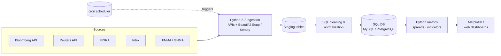

# Structured Finance Pricing Pipeline (Python + SQL)

> Real-time aggregation & normalization of market pricing for US structured finance securities · **2014** · Python 2.7 + SQL

**Role at the time:** Data Engineer · *(2014 — start of my Data Engineer → Senior Data Engineer years)*
**Type:** Portfolio case study — architecture & approach are representative; production code is proprietary.

---

## Context

A pricing-analyst team needed timely, consistent prices for US structured finance securities (RMBS/CMBS/ABS), but the inputs were scattered across vendors — Bloomberg, Reuters, FINRA, Intex, FNMA and GNMA — each with its own format, identifiers and pricing conventions. Analysts were stitching this together by hand, which was slow and error-prone.

This project (my first end-to-end data engineering build, **circa 2014**) automated the collection, cleaning and normalization of that data into a single consistent store, with lightweight dashboards on top. It is the **foundation stage** of my journey: pure Python and SQL, on-premises, no cloud and no distributed compute — because in 2014 that was the stack.

## Architecture

## Tech stack

- **Languages:** Python 2.7, SQL
- **Ingestion:** Vendor APIs (Bloomberg/Reuters/FINRA/Intex/FNMA/GNMA), web scraping (Beautiful Soup, Scrapy)
- **Storage / modeling:** Relational SQL database (MySQL, PostgreSQL)
- **Processing:** Python scripts, SQL transformations
- **Visualization:** Matplotlib, basic web dashboards
- **Automation:** cron jobs, custom scheduling scripts

## Data model & architecture

- **Staging → normalized** two-tier relational model: raw vendor payloads land in per-source staging tables, then are conformed into normalized pricing tables keyed by a common security identifier.
- A **security master / cross-reference** maps vendor-specific identifiers (CUSIP and vendor tickers) to a single internal key so the same bond from two vendors reconciles.
- Normalization layer standardizes **price quoting conventions** (clean vs dirty price, yield vs spread) so downstream consumers compare like-for-like.

## Key design decisions

- **Normalize at write time, not read time** — divergent vendor conventions are reconciled once during load, so every downstream query and dashboard sees consistent prices.
- **Robust ingestion over clever ingestion** — explicit retry/back-off and error handling per source, because vendor APIs and scraped pages failed unpredictably; a partial source should never corrupt the store.
- **SQL as the contract** — the normalized schema is the stable interface between messy sources and analysts, insulating users from upstream change.
- **Scheduled + idempotent** — cron-driven loads designed to be safely re-runnable for a given as-of date.

## Outcome & impact

- Replaced manual, multi-source price assembly with an automated pipeline, freeing analyst time for actual pricing judgment.
- Improved **consistency and accuracy** through one normalization path instead of many ad-hoc spreadsheets.
- Gave the desk **timely** prices and basic trend visibility, supporting faster pricing decisions.
- Established reusable patterns (source adapters, staging→normalized, security cross-reference) I carried into every later platform.

## Where this sits in my journey

Part of my journey toward **Data & AI Platform Engineer** — the **2014 Foundations** stage, when I was a **Data Engineer** and the toolkit was just Python and SQL.

⏮ prev: _(start of the journey)_ · ⏭ next: [market-performance-analytics-python-ml](https://github.com/kamalakarpeta/market-performance-analytics-python-ml)
Full journey: https://kamalakarpeta.github.io

## Contact

LinkedIn: https://www.linkedin.com/in/kamalakarpeta/
